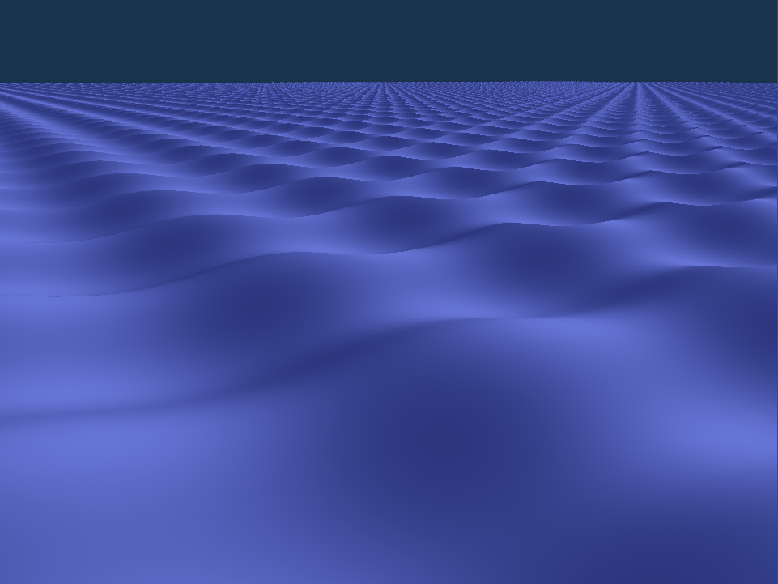

# 2024-03-18

Has 2d waves, one in X direction, one in Y direction. Things can barely be seen, need to change camera and perspective

## Camera
Has a position in space + direction where it's looking at. It supports moving via keyboard shortcuts.

## Shape
Waves are a linear combination of 2 sine waves, one in the x direction and one in the y direction. They have a constant amplitude and frequency.

## Colours
There's two colours, darker and bright. They are determined by the angle to the light.

# Perspective
Took some time because of a typo in a variable name

# Colours
Improved colours, also nonlinear scaling (calculate dot product between light dir and surface normal, then take to 4th power = amplitude. Then do mix(dark, light, amplitude))

# 2024-03-25

Fully working relative camera. Restructured code to be more compartmentalised.
Setting the perspective far plane to 1000, so we can render larger fields of sea.

