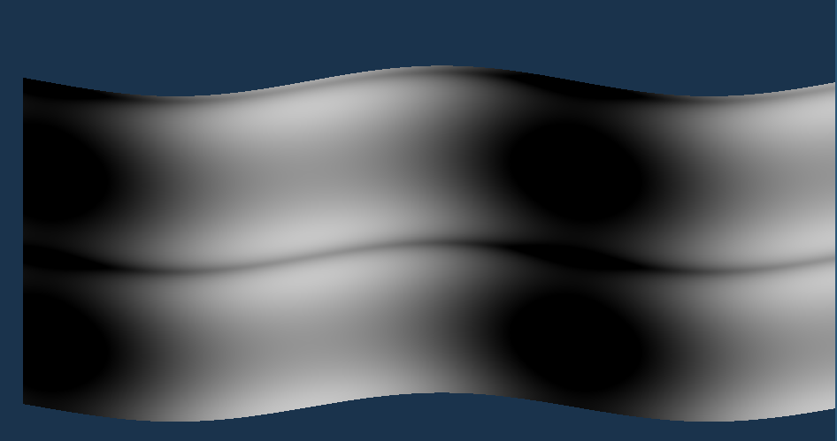

# 2024-03-18

Has 2d waves, one in X direction, one in Y direction. Things can barely be seen, need to change camera and perspective

## Camera
Has a position in space + direction where it's looking at. It supports moving via keyboard shortcuts.

## Shape
Waves are a linear combination of 2 sine waves, one in the x direction and one in the y direction. They have a constant amplitude and frequency.

## Colours
There's two colours, darker and bright. They are determined by the angle to the light.