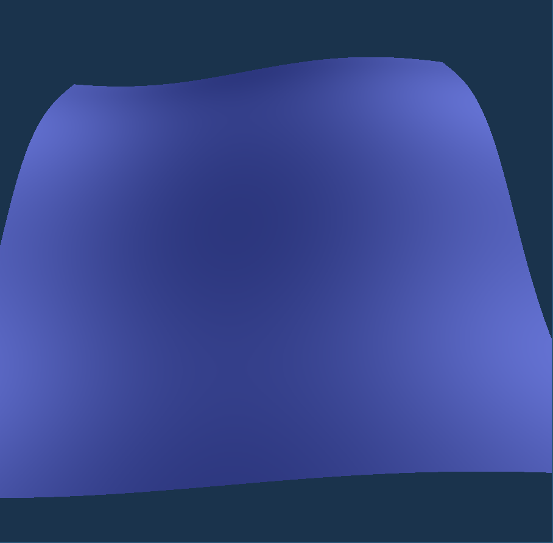

# Real time simulation of water surface
The goal of this project is to create a real time simulation of water surface. To achieve this I am writing a program in Rust with the Glow library.

## Infrastructure
Rust is a modern low level programming language. As I've barely done anything with it, the first goal of the project was to learn more about the features of the language. Glow is a Rust API to the OpenGL graphics API. This allows us to run code on the Graphics Processing Unit (henceforth GPU), which makes the goals of the project realistic. The library itself is a very minimal wrapper over OpenGL, it just renames C FFI functions to be in-line with the Rust naming conventions and declares the correct types for the function. The process of writing graphics code (called shaders) is still done in SPIR-V or GLSL. Since SPIR-V is usually produced by compiling GLSL, I chose the more straightforward method and used GLSL for writing the code that executes on the GPU. I'm using the SDL2 library to interface with the OS - it provides the functionality to capture keypresses and display windows with the OpenGL context.

The code written in Rust is processed on the CPU, the code written in GLSL is processed on the GPU. The CPU code prepares the data that GPU processes. The processed data is then directly displayed (and we never send data back to the CPU, as that is usually too slow for real-time rendering). There are two types of data used in the project: uniform variables and vertex buffers. Vertex buffer stores vertices of triangles that make up our water surface. When they are sent to the GPU, each vertex is processed independently and does not see its neighboring vertices. All that the shader code gets is the coordinates of its own vertex. Then the GPU executes code for every vertex in parallel extremely efficiently. The uniform variables are the opposite of this; they are shared values for every execution. A good example of this is the "time" variable. We want to process the shape of the water at a certain point in time, so the program gets "point in space" (from vertex buffer) and "time" as a uniform variable. With that fixed time, we compute the shape for every vertex. Then we increment the time, and run the programs again for every vertex.

The program proceeds with the following sequence of steps:
- Reading the configuration file (which sets the number of vertices, speed of simulation, ...)
- Creating an OpenGL context.
- Attaching the shader programs.
- Creating uniform data that will be sent to the program
    - Current time in the simulation
    - The camera (4x4 projective matrix that allows us to rotate and move around)
    - Perspective matrix (4x4 projective matrix that encodes perspective transformation, so objects further away appear smaller)
    - The parameters of the waves (amplitude, frequency and speed for each wave of the water)
- Creating the vertex buffer data (a flat sheet of triangles)
- Starting the Event loop
    - Process keyboard events (moving and rotating in space)
    - Updating the camera and time uniforms
    - Drawing the scene

## Algorithm

The algorithm for the task has to be fairly simple to allow for real time rendering. The water is made up of millions of triangles that have to be drawn in only ~10ms. The simplest, but very successful, approach is the "sum of sines" approximation, as seen in [GPU Gems](https://developer.nvidia.com/gpugems/gpugems/part-i-natural-effects/chapter-1-effective-water-simulation-physical-models). The technique was the state of the art for real time water simulation 20 years ago and, due to the low performance of the machines, was often used with very few waves and triangles. Prior to that, they usually did not bother simulating waves at all and only presented them as a flat sheet (perhaps moving and tilting) with a moving texture.

### Vertex shader
The vertex shader can be found in the shader.vert file.

The Sum of Sines algorithm is quite simple: water is presented as the graph of a 2D function of the form
```math
    f(x,y) = \sum_{i=0}^N a_i\sin(b_i\cdot x + c_i\cdot y + d_i\cdot t)
```

We subdivide the surface into triangles and send it off to the shader along with the parameters a, b, c and d. Currently, N, the number of waves, is fixed and hardcoded as GLSL does not *really* have loops - if one wants to index the arrays in a for loop  
for (int i = 0; i < N; ++i) a[i]  
Then the value N must be a compile time constant. The shader compilation process then unrolls the loop into an explicit sequence of steps.

Then we use the vertex shader to apply the transformation to the vertex. We start with z=0, loop over the every wave and add the value of the wave at this point in space. Then we use the `gl_Position` variable to store the final position of the vertex. This is also the point where we multiply with the camera and perspective matrices - for OpenGL the camera is always at the center, so the camera matrix moves every vertex (analogous to moving the camera). The perspective matrix then moves the vertices furthest away to be closest together. These features are very natural to OpenGL, which can be seen by `gl_Position` being a 4 element vector (rather than 3); it's a vector in projective space, where perspective and camera transformations can be done via simple matrix multiplication.  
Regardless, the vertex shader outputs the water surface (3D point in space) into the next shader in the graphics pipeline and stores the value of the vertex position as an OpenGL primitive.

### Fragment shader
The fragment shader can be found in the shader.frag file.

The next step is the fragment shader. This is responsible for the colouring, which is a bit more involved at the moment.

We first set various parameters of the shader. One such parameter is the position of the sun. Without simulating shadows, we could not see anything (the water surface would seem like a flat sheet - the shadows give us the features and impression of depth). To compute the shadows at a certain point in space, we first need to compute the normal to the surface. That's because if the normal points directly towards the sun, the surface will be maximally bright. If it points away, it's darker (like how the day is brightest at noon and gets darker as sun starts pointing at a slanted angle). Again we loop through every wave at a point in space, compute the partial derivative of a wave and add them up. We compute the partial derivatives by x and y, which are then used to get the normal to the surface
```math
\left(-\frac{\partial z}{\partial x}, -\frac{\partial z}{\partial y}, 1\right)
```
Then we compute the dot product with the direction of the sun to determine how much to shade.

A similar process is used for sun reflections.  
Here we store the position of the camera, the position of the sun, the size of the sun and a "critical angle", beyond which light has to be reflected. If the angle from the camera to the water is larger than the critical angle and the reflection points towards the sun, we colour the point whiter.  
For a better quality, we use two sun sizes - a larger one, and a smaller one. If the reflection points towards the smaller size, the influence of the sun is maximal. Outside of the larger one, we do not draw the reflection of the sun at all. For values inbetween, we interpolate the value of the influence. This allows the edges of the reflection to not be as sharp.

## Rust files
### camera.rs
This file describes the camera utilities. It has the code that allows you to look at a certain direction, as well as the code that maps the keyboard inputs to camera movements.

### config.rs
This file defines the configuration files for the program. I did not want to hardcode the parameters, so they're instead passed as a plaintext file. The rust file defines the possible parameters and the utility function that allows you to read it.

### main.rs
This is the entry point of the program and defines the flow, as described in the infrastructure section.

### opengl_utils.rs
This utility file has functions for creating an OpenGL context, attaching shaders to an OpenGL program and for capturing keyboard events from the window that OpenGL is drawing to.

### shader_utils.rs
A minimalist utilities file which just reads the shader file to a string. The string is then passed to the OpenGL during runtime, which compiles the code to machine instructions. Once the shaders are attached to the GPU, they don't need to be recompiled again and the plaintext format doesn't slow the performance down - this was the only way to pass in shaders until OpenGL 4.6, which introduced loading in bytecode in SPIR-V format. If I used that, the file would instead read the bytecode instead of plaintext and there would be a separate compilation step prior to running the code. The GPU can't run the SPIR-V bytecode either, as it's only an intermediary format, so it would need to compile it further regardless.

## Pictures

The initial working state of the program. I represented water surface as a sum of two perpendicular waves. The colours were black and white (white pointing towards the sun and black away). The perspective was not working yet. It looks very weird, like a rotating square prism.  


The same image with perspective working and minor modifications.  


Improved the colour model of the program. I also improved the camera movement, but that cannot be seen in the picture (the movement is now relative, as in programs like Blender or Autodesk Maya. Before it was determined by "current position" and "look at position". You moved the coordinates of each with the keyboard. Now it is "current position" and "look at direction" - pressing "W" will move the camera forward in the direction camera is facing in, rather than moving the "look at" coordinates, which is much more intuitive to use).  


Large scale expansion of the water surface. It still works <16ms per frame (which is 60FPS, the limit of my windowing system as you have to jump through a lot of hoops to disable Vsync on it).  


Reworked lighting system again. Waves are now a linear combination of 32 randomly chosen waves (with frequency inversely proportional to amplitude). The sun reflection has also been added. This is the current state of the program.  


## Gerstner waves
I am currently in the process of implementing gerstner waves in the vertex and fragment shader.

Gerstner waves are periodic functions, just like sine waves, but they offer additional customizability. They allow setting parameters such that the peaks of the waves are sharper than the lows. This allows you to model the surface of rough ocean waves better than just sine waves (although sine waves work well for modeling calm ponds). As before, we do a linear combination of the waves.

The equations for the gerstner waves are a bit more complex and the surface is now a parametric surface (rather than a graph of a function, as before). This also makes the parameters less intuitive and harder to get right.

The following are the equations for a single gerstner wave (in their simplest form):  
```math
X=x−Q⋅A⋅sin(k⋅(x+c⋅t))
```
```math
Y=y−Q⋅A⋅cos⁡(k⋅(x+c⋅t))
```
```math
Z=A⋅cos⁡(k⋅(x+c⋅t))
```

While the upwards component (Z) is only a normal trigonometric function, the offsets in the X and Y direction create a more dynamic shape of the wave. The non-graph nature of the surface also makes the work of the fragment shader more difficult where we also have to compute the normal and tangent to the surface.

I still have to determine better parameters for the simulation, which is very difficult for me as I am not an artist. Both for the shape of the waves, as well as the colours.

The program would also benefit from a lot of ambient effects, such as clouds and their reflections and better sky colours, which influence the human preference a lot. But that's beyond the scope of the program for now.
